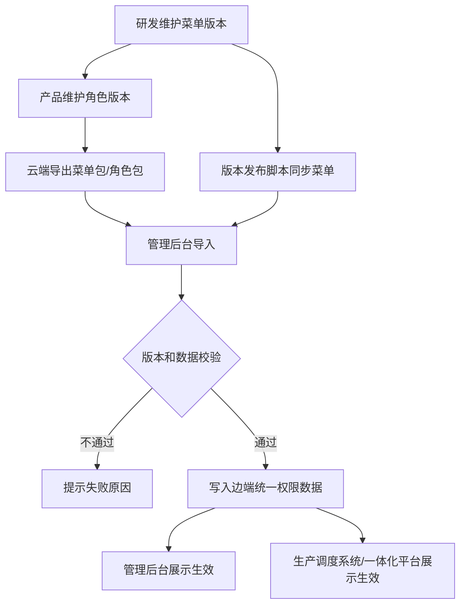
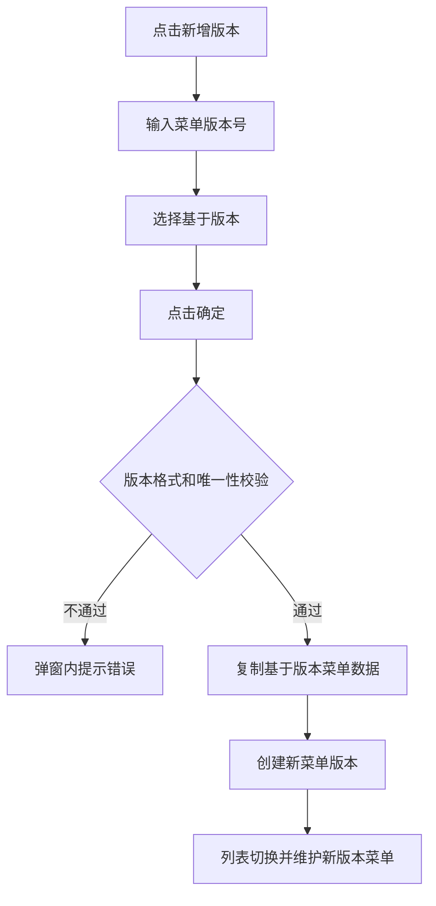
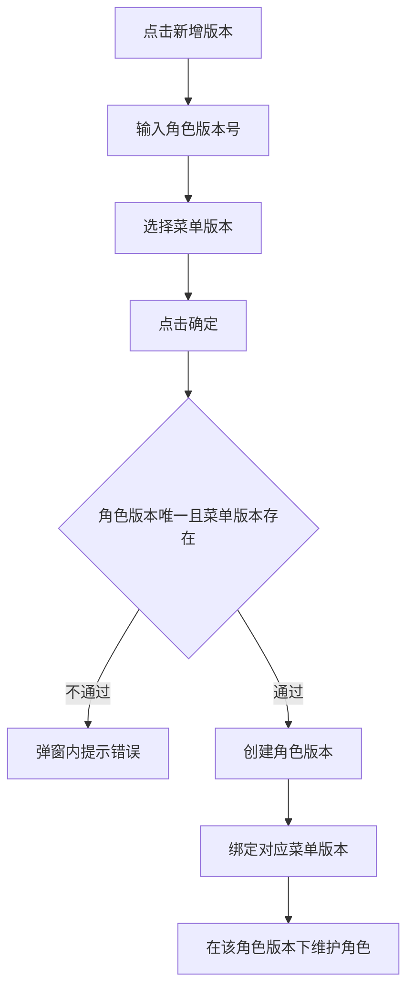
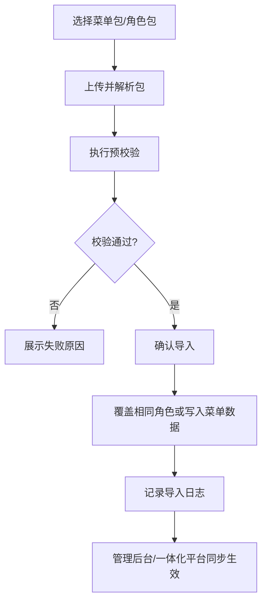
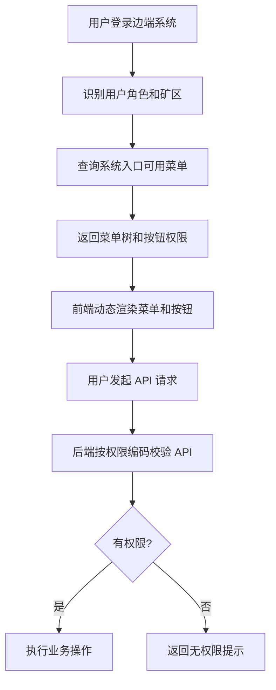

# 调度系统页面功能动态配置 PRD

## 1. 产品概述

为适配 20 多个矿区边端系统版本不一致的现状，需要在运维管理平台按版本维护菜单和角色，并将配置同步到管理后台、一体化平台、生产调度系统，实现页面、按钮、API 权限的动态展示和动态校验。

本期产品目标：

1. 运维管理平台支持菜单版本和角色版本管理。
2. 运维管理平台支持菜单包、角色包导出。
3. 管理后台支持菜单包、角色包导入，并做版本校验。
4. 管理后台导入后的菜单、角色、权限数据在管理后台和一体化平台同步生效。
5. 生产调度系统根据用户权限动态展示页面和功能。

## 2. 用户角色

| 用户角色 | 使用系统 | 核心诉求 |
| --- | --- | --- |
| 研发 | 运维管理平台 | 按版本维护菜单、按钮、权限编码、API 绑定 |
| 产品 | 运维管理平台 | 按版本维护角色和授权范围 |
| 矿区现场运维 | 管理后台 | 导入云端菜单、角色，维护现场权限 |
| 矿区用户 | 生产调度系统 / 一体化平台 | 只看到自己有权限使用的页面和功能 |
| 发布人员 | 发布流程 | 通过脚本同步指定菜单版本到管理后台 |

## 3. 产品流程

### 3.1 总流程

### 3.2 菜单版本创建流程

### 3.3 角色版本创建流程

### 3.4 边端导入流程

### 3.5 用户权限展示流程

## 4. 功能需求

### 4.1 运维管理平台 - 菜单管理

#### 4.1.1 新增菜单版本

入口：菜单管理页面，新增“新增版本”按钮。

弹框字段：

| 字段 | 控件 | 必填 | 规则 |
| --- | --- | --- | --- |
| 版本号 | 输入框 | 是 | 符合平台语义版本规则，不能重复 |
| 基于版本 | 下拉框 | 是 | 下拉展示已存在菜单版本 |

交互规则：

1. 点击确定时校验版本号格式和唯一性。
2. 校验通过后，复制“基于版本”的菜单数据到新版本。
3. 创建成功后提示成功，并支持在菜单版本筛选项中选择新版本。

异常提示：

| 场景 | 提示 |
| --- | --- |
| 版本号为空 | 请输入菜单版本号 |
| 版本号格式错误 | 菜单版本号不符合平台版本规范 |
| 版本号重复 | 菜单版本已存在 |
| 未选择基于版本 | 请选择基于版本 |

验收标准：

1. 可基于任意已有菜单版本创建新菜单版本。
2. 新菜单版本创建后菜单数据与基于版本一致。
3. 重复或非法版本号不能保存。

#### 4.1.2 菜单检索和列表

检索项：

| 字段 | 控件 | 说明 |
| --- | --- | --- |
| 菜单版本 | 下拉框 | 展示所有菜单版本 |
| 系统名称 | 下拉框 | 支持按系统筛选 |
| 菜单名称 | 输入框 | 保留现有菜单名称查询能力 |

列表要求：

1. 列表以树状结构展示目录、菜单、按钮层级。
2. 列表展示系统名称、菜单名称、类型、权限编码、排序、状态。
3. 操作列包含详情、新增、编辑、删除。
4. 切换菜单版本后，列表展示该版本菜单数据。

验收标准：

1. 能清晰查看目录、菜单、按钮三级关系。
2. 不同菜单版本之间的数据互不串扰。
3. 可按系统名称维护不同系统菜单。

#### 4.1.3 菜单新增 / 编辑 / 详情

字段：

| 字段 | 控件 | 说明 |
| --- | --- | --- |
| 系统名称 | 下拉框 | 必填，使用稳定系统编码 |
| 菜单类型 | 单选 | 目录 / 菜单 / 按钮 |
| 上级节点 | 树选择 | 根据当前菜单版本和系统名称选择 |
| 菜单名称 | 输入框 | 必填 |
| 权限编码 | 输入框 | 菜单和按钮建议必填 |
| API 绑定 | 多行输入 / 表格 | 一个权限编码可绑定多个 API |
| 排序 | 数字输入 | 数字越小越靠前 |
| 是否显示 | 开关 | 控制前端是否展示 |
| 状态 | 开关 | 启用 / 禁用 |

验收标准：

1. 目录、菜单、按钮可按层级新增。
2. 权限编码和 API 绑定可在详情中查看。
3. 禁用节点不应在运行态权限中生效。

#### 4.1.4 菜单导出

入口：菜单管理页面“导出”按钮。

导出规则：

1. 支持选择指定菜单版本导出。
2. 默认导出该版本所有系统菜单。
3. 导出包包含菜单版本、系统编码、菜单树、权限编码、API 绑定、排序、状态。

验收标准：

1. 导出包可被管理后台菜单导入功能识别。
2. 导出内容完整覆盖指定版本的所有系统菜单。

### 4.2 运维管理平台 - 角色管理

#### 4.2.1 新增角色版本

入口：角色管理页面，新增“新增版本”按钮。

弹框字段：

| 字段 | 控件 | 必填 | 规则 |
| --- | --- | --- | --- |
| 角色版本号 | 输入框 | 是 | 符合平台语义版本规则，不能重复 |
| 菜单版本 | 下拉框 | 是 | 必须选择已存在菜单版本 |

验收标准：

1. 角色版本不能重复。
2. 角色版本创建后必须绑定一个菜单版本。
3. 后续新增、编辑角色时，只能授权该菜单版本下的菜单权限。

#### 4.2.2 角色检索和列表

检索项：

| 字段 | 控件 | 说明 |
| --- | --- | --- |
| 角色版本 | 下拉框 | 展示所有角色版本 |
| 所属矿区 | 下拉框 | 支持全部矿区和指定矿区 |
| 角色名称 | 输入框 | 保留现有能力 |

列表要求：

1. 展示角色编码、角色名称、角色版本、绑定菜单版本、所属矿区、状态。
2. 切换角色版本后，列表角色同步切换。
3. 支持导出当前筛选条件下的角色。

验收标准：

1. 不同角色版本之间角色数据互不串扰。
2. 所属矿区可检索、可展示。

#### 4.2.3 角色新增 / 编辑

能力：

1. 新增角色时，可从已存在角色版本中选择角色作为模板复用。
2. 编辑角色时，可调整角色基础信息、所属矿区、菜单和按钮权限。
3. 授权菜单必须来自当前角色版本绑定的菜单版本。
4. 所属矿区可选全部矿区 `ALL` 或指定唯一矿区。

相同角色覆盖口径：

1. 默认按 `roleCode + mineScope` 判断相同角色。
2. 该规则需在评审中确认。

验收标准：

1. 复用角色后，权限默认带出并可编辑。
2. 保存后只影响当前角色版本。
3. 角色授权树与绑定菜单版本一致。

#### 4.2.4 角色导出

入口：角色管理页面“导出”按钮。

导出规则：

1. 导出当前筛选条件下的所有角色。
2. 导出包包含角色版本、绑定菜单版本、角色信息、所属矿区、授权权限编码。
3. 角色包不内置完整菜单树，仅引用菜单版本和权限编码。

验收标准：

1. 导出的角色包可被管理后台角色导入功能识别。
2. 筛选条件变化后，导出内容随筛选条件变化。

### 4.3 管理后台 - 菜单导入

入口：管理后台菜单或权限管理页面，新增“导入菜单”按钮。

操作流程：

1. 点击导入菜单。
2. 选择运维管理平台导出的菜单包。
3. 系统解析并展示菜单版本、系统数量、菜单数量、权限数量。
4. 系统执行版本和结构校验。
5. 校验通过后确认导入。
6. 导入成功后记录日志并刷新运行态菜单数据。

校验规则：

| 场景 | 规则 |
| --- | --- |
| 菜单版本低于当前版本 | 阻止导入 |
| 菜单包结构错误 | 阻止导入 |
| 版本号格式错误 | 阻止导入 |
| 权限编码重复且含义冲突 | 阻止导入 |

验收标准：

1. 低版本菜单包不能导入。
2. 合法菜单包导入后，管理后台和一体化平台菜单同步变化。
3. 导入失败有明确原因。

### 4.4 管理后台 - 角色导入

入口：管理后台角色管理页面，新增“导入”按钮。

操作流程：

1. 点击导入。
2. 选择运维管理平台导出的角色包。
3. 系统解析并展示角色版本、绑定菜单版本、角色数量、影响矿区。
4. 系统执行版本、菜单版本、权限引用校验。
5. 校验通过后确认导入。
6. 相同角色按 `roleCode + mineScope` 覆盖。
7. 导入成功后记录日志并刷新运行态权限数据。

校验规则：

| 场景 | 规则 |
| --- | --- |
| 角色版本低于当前角色版本 | 阻止导入 |
| 角色包绑定菜单版本低于当前菜单版本 | 阻止导入 |
| 角色引用了不存在的权限编码 | 阻止导入 |
| 角色包结构错误 | 阻止导入 |

验收标准：

1. 同角色覆盖后，旧授权被新授权替换。
2. 非相同角色新增写入。
3. 导入成功后，管理后台和一体化平台权限同步生效。

### 4.5 版本发布菜单同步

入口：版本发布流程中的提测单脚本。

能力：

1. 支持指定菜单版本。
2. 支持指定目标系统或默认同步全部系统菜单。
3. 支持将指定菜单版本同步到管理后台。
4. 输出同步成功、失败、跳过数量和失败原因。

验收标准：

1. 发布人员可通过脚本完成指定菜单版本同步。
2. 同步失败不影响已有边端菜单数据。
3. 同步结果可追溯。

### 4.6 边端动态展示

运行规则：

1. 用户进入管理后台、一体化平台或生产调度系统时，系统按入口系统编码、用户角色、所属矿区获取菜单树。
2. 前端按菜单树渲染目录和页面入口。
3. 前端按按钮权限编码控制按钮展示。
4. 后端接口按权限编码和 API 绑定关系强校验。

验收标准：

1. 用户只能看到被授权的页面和按钮。
2. 直接调用未授权 API 时，后端返回无权限。
3. 角色或菜单导入后，刷新或重新登录后能看到最新权限效果。

## 5. 非功能需求

| 类型 | 要求 |
| --- | --- |
| 安全 | 前端仅控制展示，后端接口必须强校验 |
| 审计 | 菜单、角色、导入、导出、脚本同步均记录操作日志 |
| 可追溯 | 日志记录操作人、时间、版本、结果、失败原因 |
| 可用性 | 导入失败提示明确，支持用户定位问题 |
| 性能 | 大批量导入不应造成页面长时间无响应 |
| 一致性 | 导入失败不落库，导入成功后统一刷新权限数据 |

## 6. 验收清单

| 编号 | 验收项 |
| --- | --- |
| A1 | 运维管理平台可创建菜单版本，并基于已有版本复制菜单 |
| A2 | 菜单管理可按菜单版本和系统名称检索，树状展示目录、菜单、按钮 |
| A3 | 菜单新增、编辑支持权限编码和 API 绑定 |
| A4 | 运维管理平台可创建角色版本，并绑定菜单版本 |
| A5 | 角色新增、编辑时授权树与绑定菜单版本一致 |
| A6 | 角色可指定全部矿区或唯一矿区 |
| A7 | 菜单包、角色包可按规则导出 |
| A8 | 管理后台可导入菜单包，且低版本包被阻止 |
| A9 | 管理后台可导入角色包，且低角色版本或低菜单版本被阻止 |
| A10 | 导入成功后，管理后台和一体化平台同步生效 |
| A11 | 用户运行态菜单和按钮按权限动态展示 |
| A12 | 未授权 API 请求被后端拦截 |

## 7. 待确认事项

| 编号 | 问题 | 默认口径 |
| --- | --- | --- |
| Q1 | 是否支持带后缀的版本号 | 暂不支持，仅支持数字语义版本 |
| Q2 | 相同角色覆盖唯一键 | 暂按 `roleCode + mineScope` |
| Q3 | 菜单和角色导入是否支持回滚 | 暂不做独立回滚，失败不落库，成功后通过高版本修正 |
| Q4 | 角色包是否内置菜单快照 | 暂不内置，仅引用菜单版本和权限编码 |

