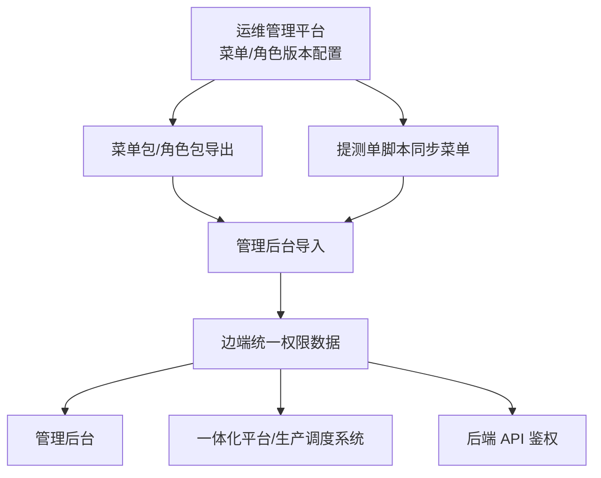
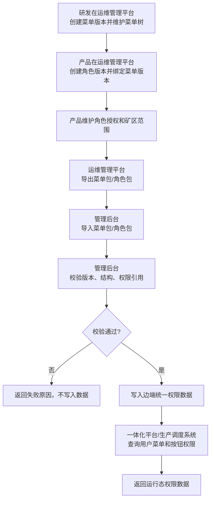
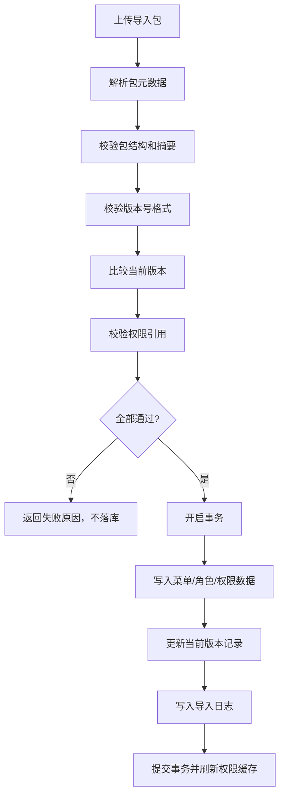

# 调度系统页面功能动态配置技术方案

## 1. 方案概述

本方案通过“云端版本化配置 + 边端导入生效 + 运行态权限查询 + 后端接口强校验”实现调度系统页面功能动态配置。

核心链路：



设计原则：

1. 云端负责配置源头，边端负责导入后的本地生效。
2. 菜单、角色都版本化，角色版本必须绑定菜单版本。
3. 前端只负责动态展示，后端接口鉴权是最终安全边界。
4. 导入必须先校验后写入，失败不落库。
5. 管理后台、一体化平台、生产调度系统共享边端同一份权限数据。

## 2. 系统职责

| 系统 | 职责 |
| --- | --- |
| 运维管理平台 | 维护菜单版本、角色版本、权限编码、API 绑定，导出菜单包和角色包 |
| 管理后台 | 导入菜单包和角色包，写入边端统一权限数据，提供现场权限管理能力 |
| 一体化平台 / 生产调度系统 | 根据边端统一权限数据动态展示页面、按钮，并发起后端接口调用 |
| 发布脚本 | 在版本发布时将云端指定菜单版本同步到管理后台 |

## 3. 数据流

### 3.1 配置流



### 3.2 导入流



## 4. 数据模型

以下为建议模型，字段可按现有表结构兼容落地。

### 4.1 `menu_version`

| 字段 | 说明 |
| --- | --- |
| `id` | 主键 |
| `version` | 菜单版本号，唯一 |
| `source_version` | 基于哪个菜单版本复制创建 |
| `status` | 启用 / 禁用 |
| `created_by` / `created_at` | 创建人和创建时间 |
| `updated_by` / `updated_at` | 更新人和更新时间 |

### 4.2 `menu`

| 字段 | 说明 |
| --- | --- |
| `id` | 主键 |
| `menu_version` | 菜单版本 |
| `system_code` | 系统编码 |
| `parent_id` | 上级节点 |
| `menu_type` | `DIR` / `MENU` / `BUTTON` |
| `name` | 节点名称 |
| `route_path` | 页面路由，按钮可为空 |
| `component` | 前端组件标识，按钮可为空 |
| `permission_code` | 权限编码 |
| `sort_no` | 排序 |
| `visible` | 是否显示 |
| `status` | 启用 / 禁用 |

### 4.3 `api_permission_binding`

| 字段 | 说明 |
| --- | --- |
| `id` | 主键 |
| `permission_code` | 权限编码 |
| `api_method` | 请求方法，如 `GET`、`POST` |
| `api_path` | API 路径 |
| `status` | 启用 / 禁用 |

### 4.4 `role_version`

| 字段 | 说明 |
| --- | --- |
| `id` | 主键 |
| `version` | 角色版本号，唯一 |
| `menu_version` | 绑定菜单版本 |
| `status` | 启用 / 禁用 |
| `created_by` / `created_at` | 创建人和创建时间 |

### 4.5 `role`

| 字段 | 说明 |
| --- | --- |
| `id` | 主键 |
| `role_version` | 角色版本 |
| `role_code` | 角色编码 |
| `role_name` | 角色名称 |
| `status` | 启用 / 禁用 |

### 4.6 `role_mine_scope`

| 字段 | 说明 |
| --- | --- |
| `id` | 主键 |
| `role_id` | 角色 ID |
| `mine_scope` | 矿区范围，全部矿区使用 `ALL`，指定矿区使用矿区编码 |

### 4.7 `role_menu_permission`

| 字段 | 说明 |
| --- | --- |
| `id` | 主键 |
| `role_id` | 角色 ID |
| `menu_id` | 菜单或按钮节点 ID |
| `permission_code` | 权限编码 |

### 4.8 `import_log`

| 字段 | 说明 |
| --- | --- |
| `id` | 主键 |
| `package_type` | `MENU` / `ROLE` |
| `package_version` | 导出包协议版本 |
| `menu_version` | 菜单版本 |
| `role_version` | 角色版本，菜单包可为空 |
| `status` | 成功 / 失败 |
| `message` | 结果说明或失败原因 |
| `operator` / `created_at` | 操作人和操作时间 |

## 5. 接口设计

接口路径为建议，可按现有网关和模块规范调整。

### 5.1 运维管理平台接口

| 接口 | 方法 | 说明 |
| --- | --- | --- |
| `/api/menu-versions` | `POST` | 创建菜单版本，基于已有版本复制菜单 |
| `/api/menu-versions` | `GET` | 查询菜单版本列表 |
| `/api/menus/tree` | `GET` | 按菜单版本、系统编码查询菜单树 |
| `/api/menus` | `POST` | 新增菜单节点 |
| `/api/menus/{id}` | `PUT` | 编辑菜单节点 |
| `/api/menus/{id}` | `DELETE` | 删除菜单节点 |
| `/api/menus/export` | `GET` | 导出指定菜单版本的菜单包 |
| `/api/role-versions` | `POST` | 创建角色版本并绑定菜单版本 |
| `/api/role-versions` | `GET` | 查询角色版本列表 |
| `/api/roles` | `GET` | 按角色版本、矿区查询角色 |
| `/api/roles` | `POST` | 新增角色 |
| `/api/roles/{id}` | `PUT` | 编辑角色 |
| `/api/roles/export` | `GET` | 导出筛选条件下的角色包 |

### 5.2 管理后台导入接口

| 接口 | 方法 | 说明 |
| --- | --- | --- |
| `/api/import/menu/preview` | `POST` | 上传菜单包并预校验 |
| `/api/import/menu/confirm` | `POST` | 确认导入菜单包 |
| `/api/import/role/preview` | `POST` | 上传角色包并预校验 |
| `/api/import/role/confirm` | `POST` | 确认导入角色包 |
| `/api/import/logs` | `GET` | 查询导入日志 |

### 5.3 运行态权限接口

| 接口 | 方法 | 说明 |
| --- | --- | --- |
| `/api/auth/menus` | `GET` | 按用户、系统编码、矿区返回可见菜单树 |
| `/api/auth/permissions` | `GET` | 返回用户按钮权限编码列表 |
| `/api/auth/check` | `POST` | 可选，校验指定权限编码是否可用 |

运行态返回建议：

```json
{
  "systemCode": "dispatch_system",
  "menuVersion": "1.2.10",
  "roleVersion": "1.2.10",
  "menus": [],
  "permissions": ["dispatch:plan:create", "dispatch:plan:export"]
}
```

## 6. 导出包结构

### 6.1 菜单包

```json
{
  "packageType": "MENU",
  "packageVersion": "1.0",
  "menuVersion": "1.2.10",
  "systems": [
    {
      "systemCode": "dispatch_system",
      "menus": []
    }
  ],
  "apiBindings": [],
  "checksum": "sha256"
}
```

### 6.2 角色包

```json
{
  "packageType": "ROLE",
  "packageVersion": "1.0",
  "roleVersion": "1.2.10",
  "menuVersion": "1.2.10",
  "roles": [
    {
      "roleCode": "dispatcher",
      "roleName": "调度员",
      "mineScope": "ALL",
      "permissions": []
    }
  ],
  "checksum": "sha256"
}
```

规则：

1. 菜单包包含菜单树和 API 绑定。
2. 角色包引用菜单版本，不内置完整菜单树。
3. 角色包中的权限编码必须存在于边端当前菜单版本或待导入菜单版本中。
4. `checksum` 用于校验包内容完整性。

## 7. 核心规则

### 7.1 版本比较

平台语义版本按数字段逐级比较：

1. 按 `.` 拆分版本号。
2. 每段按数字比较，不按字符串比较。
3. 缺失段按 `0` 处理。
4. 示例：`1.2.10 > 1.2.9`，`1.3.0 > 1.2.99`。

暂不支持带后缀版本号，如 `1.2.0-beta`。如平台规范需要支持，需扩展比较器。

### 7.2 菜单导入

1. 解析菜单包。
2. 校验包类型为 `MENU`。
3. 校验菜单版本格式。
4. 校验导入菜单版本不小于当前菜单版本。
5. 校验系统编码、菜单类型、权限编码、API 绑定结构。
6. 事务写入菜单、API 绑定、当前菜单版本记录。
7. 刷新运行态权限缓存。

### 7.3 角色导入

1. 解析角色包。
2. 校验包类型为 `ROLE`。
3. 校验角色版本格式和菜单版本格式。
4. 校验角色版本不低于当前角色版本。
5. 校验角色包绑定菜单版本不低于当前菜单版本。
6. 校验角色授权权限编码存在。
7. 按 `roleCode + mineScope` 覆盖相同角色，非相同角色新增。
8. 事务写入角色、矿区范围、角色权限、当前角色版本记录。
9. 刷新运行态权限缓存。

### 7.4 权限生效

1. 用户登录后，按用户角色、所属矿区、系统编码查询角色集合。
2. `mineScope = ALL` 的角色适用于所有矿区。
3. 指定矿区角色仅在对应矿区生效。
4. 菜单树只返回启用、可见且已授权的目录和菜单。
5. 按钮权限以权限编码列表返回给前端。
6. API 请求进入后，后端根据请求方法、路径匹配权限编码，再校验用户是否拥有该权限编码。

## 8. 发布脚本方案

提测单脚本参数建议：

| 参数 | 说明 |
| --- | --- |
| `menuVersion` | 必填，待同步菜单版本 |
| `targetEnv` | 必填，目标管理后台环境 |
| `systemCode` | 可选，指定系统编码，不传则同步全部系统 |
| `operator` | 必填，执行人 |

执行步骤：

1. 从运维管理平台拉取指定菜单版本数据。
2. 生成菜单包或调用管理后台导入接口。
3. 管理后台执行与手工导入一致的校验。
4. 输出同步结果、失败原因、导入日志 ID。

## 9. 异常场景

| 场景 | 处理 |
| --- | --- |
| 版本低于当前版本 | 阻止导入，提示当前版本和导入版本 |
| 版本格式非法 | 阻止导入，提示平台版本规范 |
| 包结构错误 | 阻止导入，提示缺失或非法字段 |
| 摘要校验失败 | 阻止导入，提示文件可能被篡改或损坏 |
| 权限编码不存在 | 阻止角色导入，提示不存在的权限编码 |
| 相同角色覆盖冲突 | 按 `roleCode + mineScope` 覆盖，并在预览中提示影响范围 |
| 数据写入异常 | 回滚事务，记录失败日志 |

## 10. 安全与审计

1. 菜单包、角色包导入需校验操作人权限。
2. 导入、导出、脚本同步均记录审计日志。
3. 导入包建议限制大小和文件类型。
4. 后端接口鉴权不得依赖前端是否展示按钮。
5. 运行态权限接口不得返回用户无权限的菜单和按钮。
6. API 绑定变更需记录变更前后内容。

## 11. 测试方案

### 11.1 单元测试

1. 版本比较：`1.2.10 > 1.2.9`、`1.3.0 > 1.2.99`、`1.2 = 1.2.0`。
2. 菜单树构建：目录、菜单、按钮层级正确。
3. 权限编码到 API 的匹配逻辑正确。
4. `ALL` 矿区角色匹配所有矿区。

### 11.2 集成测试

1. 云端创建菜单版本后，菜单数据复制正确。
2. 云端创建角色版本后，绑定菜单版本正确。
3. 菜单包导入成功后，边端菜单版本更新。
4. 低版本菜单包导入失败。
5. 角色包导入成功后，相同角色被覆盖。
6. 低角色版本或低菜单版本角色包导入失败。

### 11.3 端到端测试

1. 用户登录生产调度系统，只看到已授权菜单。
2. 用户只看到已授权按钮。
3. 用户直接调用未授权 API，被后端拦截。
4. 管理后台导入菜单、角色后，一体化平台刷新后同步生效。
5. 发布脚本同步指定菜单版本后，管理后台菜单版本更新。

## 12. 验收标准

1. 三端权限数据链路闭环：云端配置、边端导入、运行态展示、后端鉴权。
2. 菜单版本和角色版本可独立维护，角色版本绑定菜单版本。
3. 管理后台能阻止低版本或非法导入包。
4. 角色覆盖规则明确且可追溯。
5. 所有导入、导出、脚本同步动作有日志。
6. 管理后台和一体化平台使用同一份边端权限数据并同步生效。

## 13. 待确认技术点

| 编号 | 问题 | 默认方案 |
| --- | --- | --- |
| T1 | 是否支持后缀版本号 | 暂不支持，仅数字语义版本 |
| T2 | 是否需要独立回滚能力 | 暂不做，依赖事务失败回滚和高版本修正 |
| T3 | 角色包是否带菜单快照 | 暂不带，仅引用菜单版本和权限编码 |
| T4 | 权限缓存刷新策略 | 导入成功后主动刷新，用户刷新或重新登录获取最新权限 |
