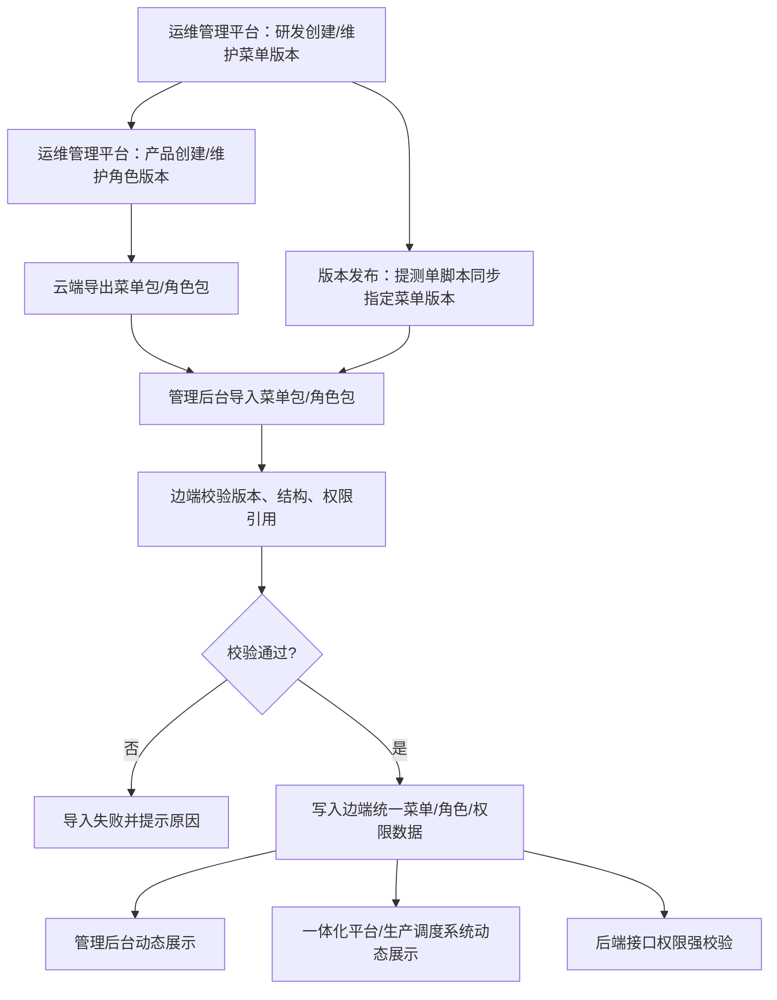
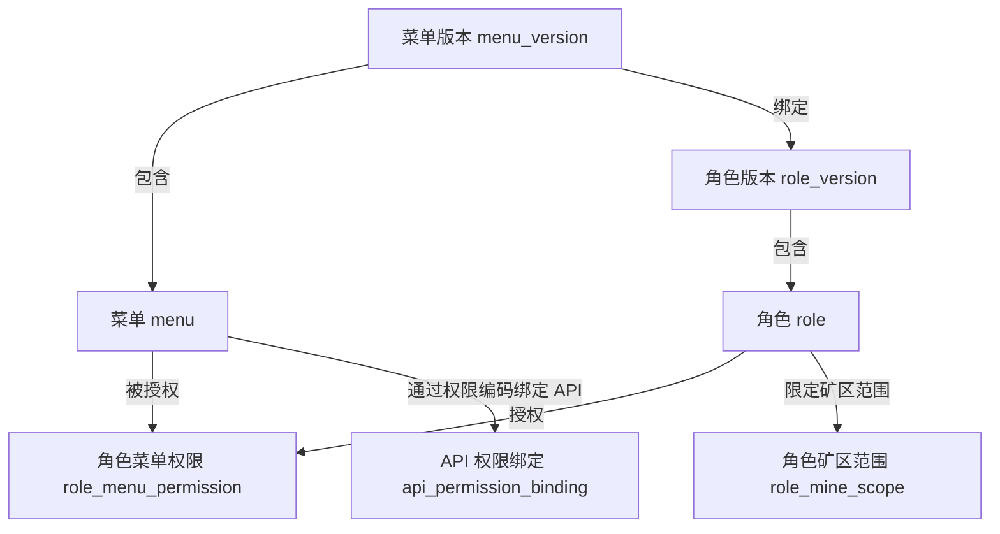

# 调度系统页面功能动态配置需求

## 1. 文档说明

本文档用于沉淀“调度系统页面功能动态配置”的原始背景、需求范围、已确认口径、待确认问题和后续评审结论。

配套文档：

| 文档 | 用途 |
| --- | --- |
| `调度系统页面功能动态配置PRD.md` | 面向产品、研发、测试评审，描述页面功能、交互、校验和验收标准 |
| `调度系统页面功能动态配置技术方案.md` | 面向研发落地，描述架构、数据模型、接口、导入导出、权限生效和测试方案 |

## 2. 背景

当前涉及三个系统：

| 系统 | 类型 | 版本特性 | 主要职责 |
| --- | --- | --- | --- |
| 运维管理平台 | 云端系统 | 当前无菜单、角色版本概念 | 研发维护菜单，产品维护角色 |
| 管理后台 | 边端系统 | 有版本概念，部署至 20 多个矿区，各矿区版本可能不同 | 矿区现场运维进行权限管理，导入云端菜单和角色数据 |
| 一体化平台 / 生产调度系统 | 边端系统 | 有版本概念，与管理后台共用同一份菜单、角色、权限数据 | 矿区用户进行权限使用，按权限动态展示页面和功能 |

由于边端部署在多个矿区，且各矿区版本不一致，需要支持同一云端系统维护多套菜单和角色配置，再按边端版本、矿区范围进行导出、导入和生效。

## 3. 业务目标

1. 支持调度系统页面、菜单、按钮、API 权限动态配置和动态展示。
2. 支持运维管理平台按版本维护菜单和角色，适配不同矿区边端版本。
3. 支持管理后台导入云端导出的菜单包、角色包。
4. 支持管理后台导入后的菜单、角色、权限数据在管理后台和一体化平台同步生效。
5. 支持版本发布时通过提测单脚本将指定菜单版本同步至管理后台。
6. 支持后续评审问题和确认结论持续沉淀到本文档。

## 4. 已确认口径

| 编号 | 事项 | 结论 |
| --- | --- | --- |
| C1 | 文档产物 | 拆分为需求文档、PRD、技术方案三份 Markdown |
| C2 | 边端系统关系 | 管理后台、一体化平台、生产调度系统按“边端同一份菜单/角色/权限数据，不同入口展示”处理 |
| C3 | 版本比较规则 | 按平台语义版本处理，数字段逐级比较，例如 `1.2.10 > 1.2.9` |
| C4 | 全部矿区 | 默认使用特殊矿区范围 `ALL`，新增矿区上线后自动适用 |
| C5 | API 绑定粒度 | 默认采用“权限编码绑定多个 API”的方式，菜单/按钮节点持有权限编码 |

## 5. 角色分工

| 角色 | 所属系统 | 操作范围 |
| --- | --- | --- |
| 研发 | 运维管理平台 | 维护菜单版本、菜单树、权限编码、API 绑定，导出菜单包 |
| 产品 | 运维管理平台 | 维护角色版本、角色授权、矿区范围，导出角色包 |
| 矿区现场运维 | 管理后台 | 导入菜单包、角色包，管理矿区现场权限 |
| 矿区用户 | 一体化平台 / 生产调度系统 | 基于自身角色权限使用页面和功能 |
| 发布人员 / 脚本 | 发布流程 | 在版本发布时同步指定菜单版本到管理后台 |

## 6. 术语说明

| 术语 | 说明 |
| --- | --- |
| 菜单版本 | 云端维护的一套菜单配置版本，对应可同步到边端的菜单能力集合 |
| 角色版本 | 云端维护的一套角色配置版本，创建时必须绑定一个菜单版本 |
| 系统名称 | 菜单所属系统，建议使用稳定编码，如 `management_backend`、`integrated_platform`、`dispatch_system` |
| 目录 | 菜单树分组节点，不直接代表页面操作 |
| 菜单 | 页面入口或路由节点 |
| 按钮 | 页面内功能操作点，例如新增、编辑、删除、导出 |
| 权限编码 | 页面、按钮、接口鉴权使用的唯一编码 |
| API 绑定 | 一个权限编码关联一个或多个后端接口 |
| 所属矿区 | 角色生效范围，可为全部矿区 `ALL` 或指定唯一矿区 |

## 7. 总体流程

## 8. 功能需求

### 8.1 运维管理平台 - 菜单管理

#### 8.1.1 新增菜单版本

菜单管理页面新增“新增版本”按钮。

弹框内容：

| 字段 | 类型 | 要求 |
| --- | --- | --- |
| 版本号 | 输入框 | 必填，符合平台语义版本规则，不能重复 |
| 基于版本 | 下拉框 | 必填，选择一个已存在菜单版本 |

提交后：

1. 校验版本号格式。
2. 校验版本号唯一性。
3. 将所选基于版本的菜单数据复制到新版本下。
4. 新版本创建成功后，菜单列表可切换到该版本维护。

#### 8.1.2 菜单检索

菜单管理检索项包含：

| 检索项 | 说明 |
| --- | --- |
| 菜单版本 | 下拉展示所有菜单版本号 |
| 系统名称 | 按系统筛选菜单 |
| 其他现有检索项 | 保持原有能力 |

选择不同菜单版本后，列表数据切换为对应版本下的菜单数据。

#### 8.1.3 菜单列表

菜单列表以树状结构展示，层级包含：

1. 目录
2. 菜单
3. 按钮

操作列包含：

| 操作 | 说明 |
| --- | --- |
| 详情 | 查看节点基础信息、权限编码、API 绑定 |
| 新增 | 在当前节点下新增目录、菜单或按钮 |
| 编辑 | 编辑当前节点 |
| 删除 | 删除当前节点 |

#### 8.1.4 菜单新增 / 编辑

新增、编辑内容包含：

| 字段 | 说明 |
| --- | --- |
| 系统名称 | 标识该节点所属系统 |
| 菜单名称 | 目录、菜单或按钮名称 |
| 菜单类型 | 目录 / 菜单 / 按钮 |
| 上级节点 | 用于构建树状层级 |
| 权限编码 | 页面、按钮或接口鉴权编码 |
| API 绑定 | 权限编码关联的后端接口 |
| 排序 | 控制展示顺序 |
| 是否显示 | 控制菜单是否展示 |
| 状态 | 启用 / 禁用 |

#### 8.1.5 菜单导出

菜单管理支持导出指定菜单版本的所有系统菜单。

导出内容至少包含：

1. 菜单版本。
2. 系统名称。
3. 菜单树。
4. 权限编码。
5. API 绑定。
6. 排序、显示状态、启停状态。

### 8.2 运维管理平台 - 角色管理

#### 8.2.1 新增角色版本

角色管理页面新增“新增版本”按钮。

弹框内容：

| 字段 | 类型 | 要求 |
| --- | --- | --- |
| 角色版本号 | 输入框 | 必填，符合平台语义版本规则，不能重复 |
| 菜单版本 | 下拉框 | 必填，选择该角色版本绑定的菜单版本 |

提交后：

1. 校验角色版本号唯一性。
2. 校验菜单版本存在。
3. 创建角色版本与菜单版本的绑定关系。

#### 8.2.2 角色检索

角色管理检索项新增：

| 检索项 | 说明 |
| --- | --- |
| 角色版本 | 下拉展示所有角色版本 |
| 所属矿区 | 支持全部矿区或指定矿区筛选 |
| 其他现有检索项 | 保持原有能力 |

选择不同角色版本后，列表中的角色数据切换为对应版本数据。

#### 8.2.3 角色新增 / 编辑

新增、编辑角色时：

1. 当前可授权菜单必须来自所选角色版本绑定的菜单版本。
2. 支持复用已存在角色版本中的角色作为模板。
3. 基于复用角色编辑后，保存到当前角色版本下生效。
4. 角色可指定全部矿区 `ALL` 或指定唯一矿区。
5. 角色列表展示所属矿区。

#### 8.2.4 角色导出

点击导出按钮时，导出当前筛选条件下的所有角色。

导出内容至少包含：

1. 角色版本。
2. 绑定的菜单版本。
3. 角色编码、角色名称等基础信息。
4. 所属矿区。
5. 角色拥有的菜单、按钮、权限编码。

### 8.3 管理后台 - 菜单导入

管理后台新增“导入菜单”按钮。

导入时：

1. 支持导入运维管理平台导出的菜单包。
2. 校验导入菜单版本不能小于当前管理后台菜单版本。
3. 校验通过后，同步云端菜单数据到边端统一权限数据。
4. 校验失败时，阻止导入并提示失败原因。

### 8.4 管理后台 - 角色导入

管理后台角色管理模块新增“导入”按钮。

导入时：

1. 支持导入运维管理平台导出的角色包。
2. 角色包导入时校验角色版本不能低于当前管理后台角色版本。
3. 角色包绑定的菜单版本不能低于当前管理后台菜单版本。
4. 导入的角色覆盖当前已存在的相同角色。
5. 相同角色默认按 `roleCode + mineScope` 判断，该规则需评审确认。

### 8.5 版本发布同步

版本发布时，支持通过提测单脚本将运维管理平台指定菜单版本同步到管理后台。

脚本需支持：

1. 指定菜单版本。
2. 指定目标系统。
3. 将对应菜单版本数据同步至管理后台。
4. 输出同步结果和失败原因。

### 8.6 边端动态展示

管理后台、一体化平台、生产调度系统使用同一份边端菜单、角色、权限数据。

展示规则：

1. 用户登录后根据用户角色、所属矿区、系统入口获取可见菜单和按钮权限。
2. 前端根据菜单树动态展示页面入口。
3. 前端根据按钮权限编码控制按钮可见性。
4. 后端根据权限编码与 API 绑定关系进行接口强校验。

## 9. 权限与版本规则

### 9.1 权限规则

| 场景 | 规则 |
| --- | --- |
| 页面展示 | 由菜单配置、角色授权、系统名称、所属矿区共同决定 |
| 按钮展示 | 由按钮权限编码与用户角色权限共同决定 |
| API 访问 | 以后端权限校验为准，前端展示不作为安全边界 |
| API 绑定 | 默认一个权限编码绑定多个 API |

### 9.2 版本规则

| 场景 | 规则 |
| --- | --- |
| 云端新增菜单版本 | 新菜单版本不能重复，按平台语义版本校验格式 |
| 云端新增角色版本 | 新角色版本不能重复，必须绑定已存在菜单版本 |
| 管理后台导入菜单 | 导入菜单版本不能小于当前菜单版本 |
| 管理后台导入角色 | 导入角色版本不能低于当前角色版本 |
| 管理后台导入角色 | 角色包绑定菜单版本不能低于当前菜单版本 |

平台语义版本采用数字段逐级比较，例如：

1. `1.2.10 > 1.2.9`
2. `2.0.0 > 1.9.9`
3. `1.3.0 > 1.2.99`

是否支持 `1.2.0-beta` 等后缀版本号，待平台版本规范确认。

## 10. 数据关系

关键字段说明：

| 数据对象 | 关键字段 |
| --- | --- |
| 菜单版本 `menu_version` | `version`、`source_version`、`status` |
| 菜单 `menu` | `system_code`、`menu_name`、`menu_type`、`permission_code`、`status` |
| 角色版本 `role_version` | `version`、`menu_version`、`status` |
| 角色 `role` | `role_code`、`role_name`、`role_version` |
| 角色矿区范围 `role_mine_scope` | `role_code`、`mine_scope` |
| API 权限绑定 `api_permission_binding` | `permission_code`、`api_method`、`api_path` |

## 11. 非功能需求

1. 菜单、角色新增和编辑需记录操作日志。
2. 导入、导出需记录操作人、操作时间、包版本、菜单版本、角色版本、结果和失败原因。
3. 导入失败需给出明确原因，避免只提示“导入失败”。
4. 大批量菜单、角色导入需避免页面长时间无响应。
5. 角色覆盖导入前建议支持预校验或差异提示。
6. 云端版本数据需支持追溯，避免误操作后无法定位问题。
7. 后端接口鉴权必须作为最终安全边界。

## 12. 待确认问题

| 编号 | 问题 | 状态 | 默认口径 / 结论 |
| --- | --- | --- | --- |
| Q1 | 平台版本规范是否支持后缀版本号，例如 `1.2.0-beta`？ | 待确认 | 暂按纯数字语义版本处理 |
| Q2 | 菜单版本与边端系统版本是否必须一一对应？ | 待确认 | 暂允许一个菜单版本适配一个或多个边端版本 |
| Q3 | “相同角色”的覆盖规则按什么唯一键判断？ | 待确认 | 暂按 `roleCode + mineScope` 判断 |
| Q4 | 角色指定全部矿区后，新矿区上线是否自动生效？ | 已确认 | 使用 `ALL`，新增矿区自动适用 |
| Q5 | API 绑定是权限编码绑定 API，还是节点直接绑定 API？ | 已确认 | 权限编码绑定多个 API |
| Q6 | 生产调度系统权限管理与一体化平台权限管理是否同一数据能力？ | 已确认 | 同一份边端菜单、角色、权限数据，不同入口展示 |
| Q7 | 角色包导入时是否需要包含菜单快照？ | 待确认 | 暂仅引用菜单版本并包含角色授权数据 |
| Q8 | 菜单导入和角色导入是否需要支持回滚？ | 待确认 | 暂要求失败不落库，成功后通过再次导入高版本修正 |

## 13. 后续问题与结论沉淀

后续评审、提问和决策结论统一补充到本章节，并同步修订 PRD 和技术方案。

| 日期 | 问题 / 讨论点 | 结论 | 影响范围 |
| --- | --- | --- | --- |
| 2026-05-08 | 文档拆分方式 | 输出需求文档、PRD、技术方案三份 Markdown | 文档结构 |
| 2026-05-08 | 边端系统关系 | 管理后台、一体化平台、生产调度系统使用同一份边端权限数据 | PRD、技术方案 |
| 2026-05-08 | 版本比较规则 | 按平台语义版本数字段逐级比较 | 导入校验、版本创建 |
